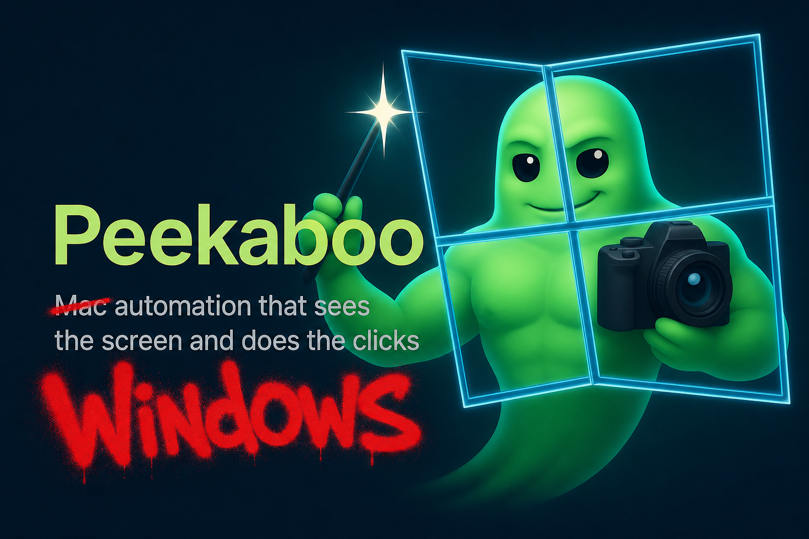

# Peekaboo 🫣 - Windows 11 automation that sees the screen and does the clicks.




[](https://opensource.org/licenses/MIT)


Untested: this was a test of `/goal` using Codex. It took 1d 7h 55m, and the
original prompt was: `fork this project and refactor it for windows 11
https://github.com/openclaw/Peekaboo`.

Peekaboo brings screen capture and GUI automation to a native Windows 11 fork.
This branch adds a standalone Swift package, `peekaboo-win11.exe`, with a
Win32-backed adapter for display/window/app enumeration, BMP capture, cursor
and keyboard input, and bounded UI Automation snapshots/actions.

## What you get
- Native Windows 11 Swift package under
  [`Platforms/Windows/PeekabooWin11`](Platforms/Windows/PeekabooWin11).
- Win32 display, window, and application enumeration with structured JSON.
- BMP screen, area, window, and foreground-window capture.
- Capture-method metadata for `gdiRegion` and `printWindow` paths.
- Cursor position reads, cursor moves, point clicks, wheel scrolling, drags,
  modifier hotkeys, and focused text typing through Win32 input APIs.
- Bounded UI Automation status, snapshots, element lookup, and common UIA
  pattern actions through the Windows UI Automation COM API.
- A Windows MCP stdio bridge at `peekaboo-win11.exe mcp serve` with an
  agent-usable desktop subset: `list`, `image`, `see`/`observe`, `snapshot`,
  input actions, and UIA inspection/actions backed by the Windows adapter.
- Shared neutral desktop contract in
  [`Core/PeekabooDesktop`](Core/PeekabooDesktop) so Windows and macOS adapters
  can use the same command model without hard-coding AppKit/CoreGraphics types.
- Release-mode package workflow that publishes `peekaboo-win11.zip` plus a
  SHA-256 checksum, `PACKAGE_MANIFEST.json`, `BUILD_INFO.txt`, and packaged
  README.
- Windows CI that builds, tests, packages, verifies, and uploads the Windows
  CLI artifact on the `windows-11-refactor` branch and PR.

## Install
- Download the latest `peekaboo-win11-<commit-sha>` artifact from the Windows
  11 Platform workflow on this branch.
- Verify the checksum after extracting the artifact:
  ```powershell
  Get-FileHash -Algorithm SHA256 .\peekaboo-win11.zip
  Get-Content .\peekaboo-win11.zip.sha256
  ```
- Extract `peekaboo-win11.zip`, then run:
  ```powershell
  .\peekaboo-win11.exe --help
  ```

## Quick start
```powershell
# Inspect the native Windows backend and advertised capabilities
.\peekaboo-win11.exe platform-info

# List displays, windows, and apps
.\peekaboo-win11.exe list displays
.\peekaboo-win11.exe list windows
.\peekaboo-win11.exe list apps

# Capture the full desktop, a rectangle, a window, or the foreground window
.\peekaboo-win11.exe capture screen --path .\screen.bmp
.\peekaboo-win11.exe capture area --rect 0,0,640,480 --path .\area.bmp
.\peekaboo-win11.exe capture window --id <window-id> --path .\window.bmp
.\peekaboo-win11.exe capture frontmost --path .\frontmost.bmp

# Read and move the cursor
.\peekaboo-win11.exe input position
.\peekaboo-win11.exe input move --point 100,100

# Send basic mouse and keyboard input
.\peekaboo-win11.exe input click --point 100,100 --button left --count 1
.\peekaboo-win11.exe input scroll --point 100,100 --direction down --amount 3
.\peekaboo-win11.exe input drag --from 100,100 --to 200,200 --button left --steps 10
.\peekaboo-win11.exe input hotkey --keys ctrl,shift,escape --hold-ms 25
.\peekaboo-win11.exe input type --text "hello from Windows" --delay-ms 5

# Probe and inspect Windows UI Automation
.\peekaboo-win11.exe automation status
.\peekaboo-win11.exe automation snapshot --scope foreground --max-depth 2 --max-elements 64
.\peekaboo-win11.exe automation element --scope root --index 0 --max-depth 0 --max-elements 1

# Serve the Windows MCP subset over stdio for MCP clients
.\peekaboo-win11.exe mcp serve
```

## Shell completions

The Windows fork does not currently ship shell completion generation. The
packaged CLI exposes its supported command surface through:

```powershell
.\peekaboo-win11.exe --help
```

For the full Windows command list and current integration notes, see
[`docs/windows-11-refactor.md`](docs/windows-11-refactor.md).

| Command | Key flags / subcommands | What it does |
| --- | --- | --- |
| `platform-info` | none | Report Windows platform metadata and native capabilities |
| `list` | `apps`, `windows`, `displays`, `--include-invisible` | Enumerate apps, windows, and displays |
| `capture screen` | `--path`, `--display` | Capture a display or the desktop to BMP |
| `capture area` | `--rect`, `--path` | Capture a rectangular screen region to BMP |
| `capture window` | `--id`, `--path` | Capture a window to BMP via `PrintWindow` or GDI fallback |
| `capture frontmost` | `--path` | Capture the foreground window to BMP |
| `input position` | none | Read the current cursor position |
| `input move` | `--point` | Move the cursor to screen coordinates |
| `input click` | `--point`, `--button`, `--count` | Send point-based mouse clicks |
| `input scroll` | `--point`, `--direction`, `--amount` | Send wheel scrolling at a point |
| `input drag` | `--from`, `--to`, `--button`, `--steps` | Drag between two screen points |
| `input hotkey` | `--keys`, `--hold-ms` | Send modifier and virtual-key hotkeys |
| `input type` | `--text`, `--delay-ms` | Type keyboard-layout translated text into the focused control |
| `automation status` | none | Probe Windows UI Automation availability |
| `automation snapshot` | `--scope`, `--max-depth`, `--max-elements` | Capture a bounded UIA control-view snapshot |
| `automation element` | `--index`, snapshot flags | Return one UIA element from a bounded snapshot |
| `automation invoke` | `--index`, snapshot flags | Invoke a UIA element when the pattern is available |
| `automation focus` | `--index`, snapshot flags | Set UIA focus on an element |
| `automation set-value` | `--index`, `--value` | Set a UIA Value-pattern value |
| `automation get-text` | `--index`, `--source`, `--max-length` | Read UIA document, selected, or visible text |
| `automation set-range-value` | `--index`, `--value` | Set a UIA RangeValue-pattern value |
| `automation scroll` | `--index`, `--horizontal`, `--vertical` | Scroll through a UIA Scroll-pattern element |
| `automation set-scroll-percent` | `--index`, `--horizontal`, `--vertical` | Set UIA scroll percentages |
| `automation set-window-state` | `--index`, `--state` | Set a UIA Window-pattern visual state |
| `automation close-window` | `--index` | Close a UIA Window-pattern window |
| `automation wait-window-idle` | `--index`, `--timeout-ms` | Wait for UIA Window-pattern input idle |
| `automation toggle` | `--index`, snapshot flags | Toggle a UIA Toggle-pattern element |
| `automation expand` / `collapse` | `--index`, snapshot flags | Expand or collapse a UIA element |
| `automation select` | `--index`, snapshot flags | Select a UIA SelectionItem-pattern element |
| `automation add-to-selection` / `remove-from-selection` | `--index` | Adjust UIA selection membership |
| `automation scroll-into-view` | `--index` | Ask UIA to scroll an element into view |
| `mcp serve` | stdio JSON-RPC | Expose the Windows desktop subset to MCP clients |

## Models and providers
- The Windows fork now packages a first MCP stdio server in
  `peekaboo-win11.exe mcp serve`.
- The Windows MCP bridge exposes the desktop subset that is backed by the
  Windows adapter today: list apps/windows/displays, capture images, observe
  with UIA snapshots, basic input actions, UIA actions, and in-process
  snapshots.
- The macOS natural-language agent loop and AI provider-backed analysis tools
  are still not packaged in the standalone Windows artifact. macOS-only tools
  such as menu, dock, dialog, space, browser, clipboard, paste, permissions,
  and provider-backed analysis are documented as unsupported by this bridge.

## Learn more
- Windows refactor notes: [docs/windows-11-refactor.md](docs/windows-11-refactor.md)
- Windows package: [Platforms/Windows/PeekabooWin11](Platforms/Windows/PeekabooWin11)
- Shared desktop contract: [Core/PeekabooDesktop](Core/PeekabooDesktop)
- Windows build script: [scripts/windows/build-win11.ps1](scripts/windows/build-win11.ps1)
- Windows package script: [scripts/windows/package-win11.ps1](scripts/windows/package-win11.ps1)
- Windows package verifier: [scripts/windows/verify-package-win11.ps1](scripts/windows/verify-package-win11.ps1)
- Windows CI workflow: [.github/workflows/windows-11-platform.yml](.github/workflows/windows-11-platform.yml)
- Upstream project: [openclaw/Peekaboo](https://github.com/openclaw/Peekaboo)

## Community

- [openclaw/Peekaboo](https://github.com/openclaw/Peekaboo) - the original
  upstream project this fork was created from.
- [PeekabooWin](https://github.com/FelixKruger/PeekabooWin) - a separate
  Windows-first rewrite of the Peekaboo automation loop (JavaScript +
  PowerShell) by [@FelixKruger](https://github.com/FelixKruger).

## Development basics
- Requirements: Windows 11 with Swift installed. The workflow currently uses
  Swift 6.3.1 on GitHub's Windows Server 2025 image family.
- Build and test:
  ```powershell
  .\scripts\windows\build-win11.ps1
  ```
- Package and verify:
  ```powershell
  .\scripts\windows\package-win11.ps1
  .\scripts\windows\verify-package-win11.ps1
  ```
- Local Linux/macOS checkouts can run docs lint and C syntax checks, but Swift
  and PowerShell execution are covered by Windows CI for this branch.

## License
MIT
